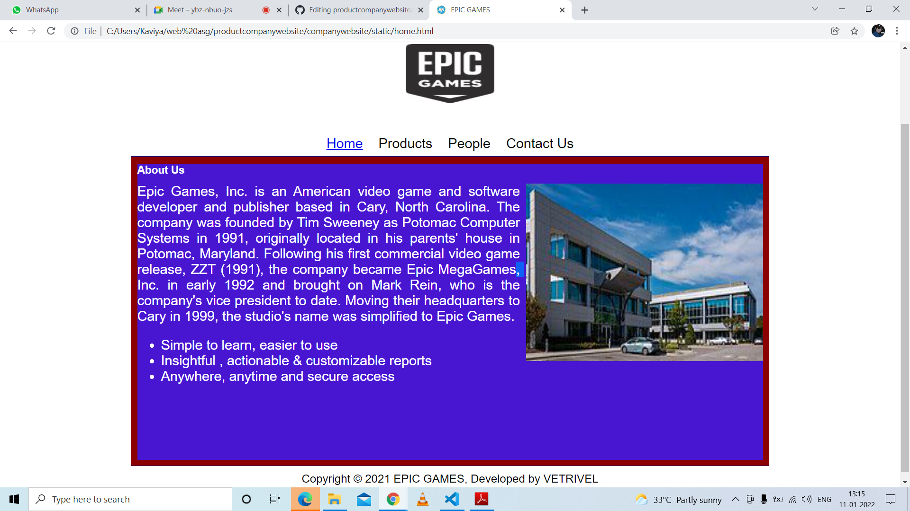
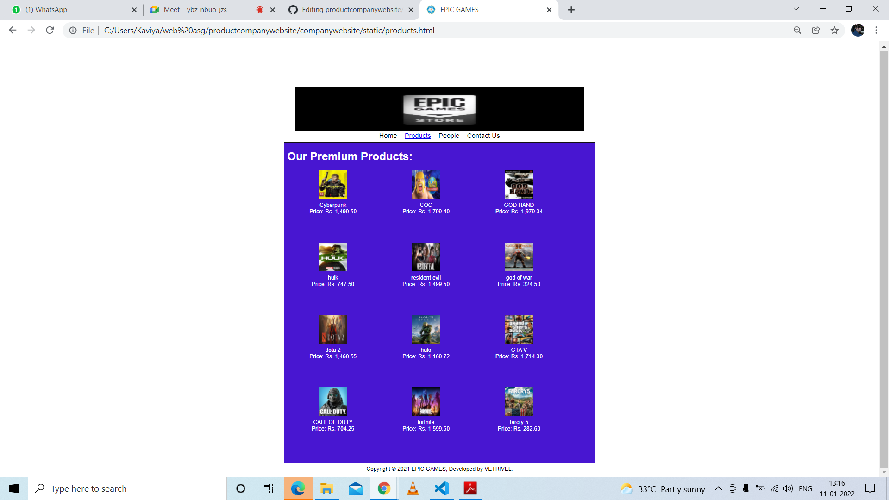
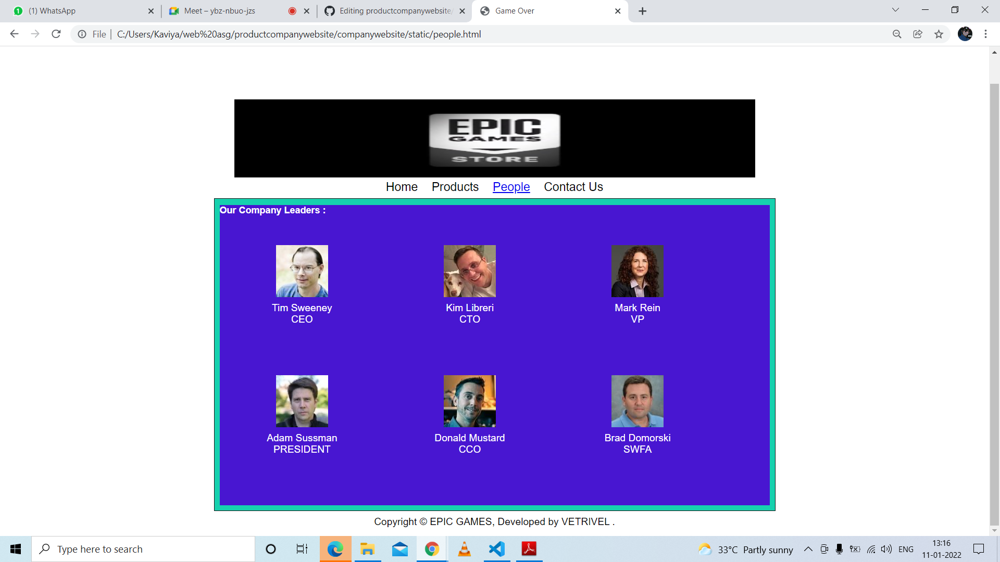
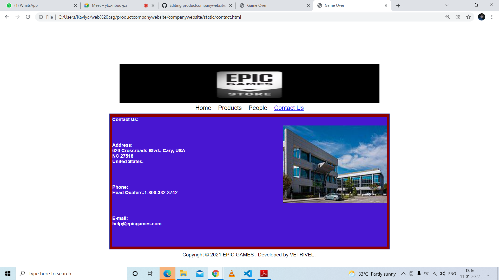

# Web Design for a Software Product Company

## AIM:

To design a static website for a software product company company.

## DESIGN STEPS:

### Step 1:

Requirement collection.

### Step 2:

Creating the layout using HTML and CSS.

### Step 3:

Updating the sample content.

### Step 4:

Choose the appropriate style and color scheme.

### Step 5:

Validate the layout in various browsers.

### Step 6:

Validate the HTML code.

### Step 6:

Publish the website in the given URL.

## PROGRAM :
```
Home Code:
<!DOCTYPE html>
<html lang="en">
  <head>
    <title>EPIC GAMES</title>
    <link rel="stylesheet" href="./css/layout.css" />
    <link rel="icon" href="./img/icon.png" type="image/x-icon" />
  </head>

  <body>
    <div class="container">
      <div class="banner"></div>
      <div class="menu">
        <div class="menuitemselected"><a href="/static/home.html">Home</a></div>
        <div class="menuitem"><a href="products.html">Products</a></div>
        <div class="menuitem"><a>People</a></div>
        <div class="menuitem"><a>Contact Us</a></div>
      </div>
      <div class="content">
        <div class="homecontent">
          <h1>About Us</h1>
          
          <div class="contenttext">
            Epic Games, Inc. is an American video game and software developer and publisher based in Cary, North Carolina. The company was founded by Tim Sweeney as Potomac Computer Systems in 1991, originally located in his parents' house in Potomac, Maryland. Following his first commercial video game release, ZZT (1991), the company became Epic MegaGames, Inc. in early 1992 and brought on Mark Rein, who is the company's vice president to date. Moving their headquarters to Cary in 1999, the studio's name was simplified to Epic Games.
            <ul>
              <li>Simple to learn, easier to use</li>
              <li>Insightful , actionable & customizable reports</li>
              <li>Anywhere, anytime and secure access</li>
            </ul>
          </div>
        </div>
      </div>
      <div class="footer">
        Copyright &#169; 2021 EPIC GAMES, Developed by VETRIVEL
      </div>
    </div>
  </body>
</html>
```
```
Product Code:
<!DOCTYPE html>
<html lang="en">
<head>
<title>EPIC GAMES</title>
<link rel="stylesheet" href="./css/layout.css" />
<link rel="icon" href="./img/icon.png" type="image/x-icon" />
</head>
<body>
<div class="container">
<div class="banner"> </div>
<div class="menu">
<div class="menuitem"><a href="/static/home.html">Home</a></div>
<div class="menuitemselected"><a href="/static/products.html">Products</a></div>
<div class="menuitem"><a href="people.html">People</a></div>
<div class="menuitem"><a href="/static/contactus.html">Contact Us</a></div>
</div>
<div class="product1">
<div class="productcontent">
<h1>Our Premium Products:</h1>
<div class="productitems">
<div class="productitem">
<div class="itemimage">

</div>
<div class="itemname">Cyberpunk</div>
<div class="itemprice">Price: Rs. 1,499.50 </div>
</div>
<div class="productitem">
<div class="itemimage">

</div>
<div class="itemname">COC
</div>
<div class="itemprice">Price: Rs. 1,799.40 </div>
</div>
<div class="productitem">
<div class="itemimage">

</div>
<div class="itemname">GOD HAND
</div>
<div class="itemprice">Price: Rs. 1,979.34 </div>
</div>
<div class="productitem">
<div class="itemimage">
  
</div>
<div class="itemname">hulk</div>
<div class="itemprice">Price: Rs. 747.50 </div>
</div>
<div class="productitem">
<div class="itemimage">

</div>
<div class="itemname">resident evil</div>
<div class="itemprice">Price: Rs. 1,499.50 </div>
</div>
<div class="productitem">
<div class="itemimage">

</div>
<div class="itemname">god of war</div>
<div class="itemprice">Price: Rs. 324.50 </div>
</div>
<div class="productitem">
<div class="itemimage">

</div>
<div class="itemname">dota 2</div>
<div class="itemprice">Price: Rs. 1,460.55 </div>
</div>
<div class="productitem">
<div class="itemimage">

</div>
<div class="itemname">halo</div>
<div class="itemprice">Price: Rs. 1,160.72 </div>
</div>
<div class="productitem">
<div class="itemimage">

</div>
<div class="itemname">GTA V</div>
<div class="itemprice">Price: Rs. 1,714.30 </div>
</div>
<div class="productitem">
<div class="itemimage">

</div>
<div class="itemname">CALL OF DUTY</div>
<div class="itemprice">Price: Rs. 704.25 </div>
</div>
<div class="productitem">
<div class="itemimage">

</div>
<div class="itemname">fortnite</div>
<div class="itemprice">Price: Rs. 1,599.50 </div>
</div>
<div class="productitem">
<div class="itemimage">

</div>
<div class="itemname">farcry 5</div>
<div class="itemprice">Price: Rs. 282.60 </div>
</div>
</div>
</div>
</div>
<div class="footer">
Copyright &#169; 2021 EPIC GAMES, Developed by VETRIVEL.
</div>
</div>
</body>
</html>
```
```
People Code:
<!DOCTYPE html>
<html lang="en">
  <head>
    <title>EPIC GAMES</title>
    <link rel="stylesheet" href="./css/layout.css" />
    <link rel="icon" href="./img/img9.png" type="image/x-icon" />
    </head>
    <body>
    <div class="container">
      <div class="banner"> </div>
      <div class="menu">
        <div class="menuitem"><a href="/static/home.html">Home</a></div>
        <div class="menuitem"><a href="/static/products.html">Products</a></div>
        <div class="menuitemselected"><a href="/static/people.html">People</a></div>
        <div class="menuitem"><a href="/static/contactus.html">Contact Us</a></div>
        </div>
      <div class="back">
        <div class="homecontent">
          <h1>Our Company Leaders :</h1><br><br>
          <div class="productitems">
            <div class="productitem"> 
                <div class="itemimage">
                
                </div>
                <div class="itemname">Tim Sweeney</div>
                <div class="itemprice">CEO</div>
            </div>
            <div class="productitem"> 
                <div class="itemimage">
                
                </div>
                <div class="itemname">Kim Libreri</div>
                <div class="itemprice">CTO</div>
            </div>
            <div class="productitem"> 
              <div class="itemimage">
              
              </div>
              <div class="itemname">Mark Rein</div>
              <div class="itemprice">VP</div>
            </div>
            <div class="productitem"> 
              <div class="itemimage">
              
              </div>
              <div class="itemname">Adam Sussman</div>
              <div class="itemprice">PRESIDENT</div>
          </div>
          <div class="productitem"> 
            <div class="itemimage">
            
            </div>
            <div class="itemname">Donald Mustard</div>
            <div class="itemprice">CCO</div>
        </div>  <div class="productitem"> 
          <div class="itemimage">
          
          </div>
          <div class="itemname">Brad Domorski</div>
          <div class="itemprice">SWFA</div>
          </div>
        </div>
        </div>        
    </div>
    <div class="footer">
      Copyright &#169; EPIC GAMES, Developed by VETRIVEL .
    </div>
   </div>
</body>
</html>
```
```
Contact Code:
<!DOCTYPE html>
<html lang="en">
  <head>
    <title>EPIC GAMES</title>
    <link rel="stylesheet" href="./css/layout.css" />
    <link rel="icon" href="./img/img9.png" type="image/x-icon" />
  </head>
  
  <body>
    <div class="container">
      <div class="banner"> </div>
      <div class="menu">
        <div class="menuitem"><a href="/static/home.html">Home</a></div>
        <div class="menuitem"><a href="/static/products.html">Products</a></div>
        <div class="menuitem"><a href="/static/people.html">People</a></div>
        <div class="menuitemselected"><a href="/static/contactus.html">Contact Us</a></div>
        </div>
      <div class="content">
        <div class="homecontent">
          <h1>Contact Us:</h1>
          
          <div class="contenttext">
            <br><br><h1>Address:
            <br>620 Crossroads Blvd., Cary, USA
            <br>NC 27518
            <br>United States.</h1>
            <br>
            <br>
            <h1>Phone: <br>
            Head Quaters:1-800-332-3742</h1>
            <br>
            <br>
           <h1>E-mail:<br>
            help@epicgames.com
           </h1>
          </div>
        </div>
      </div>
      <div class="footer">
        Copyright &#169; 2021 EPIC GAMES , Developed by VETRIVEL .
      </div>
    </div>
  </body>
</html>
```
## OUTPUT:

## Home:

## product :

## people:

## contact:


## Result:

Thus a website is designed for the software product company and the HTML,CSS code are validated.
